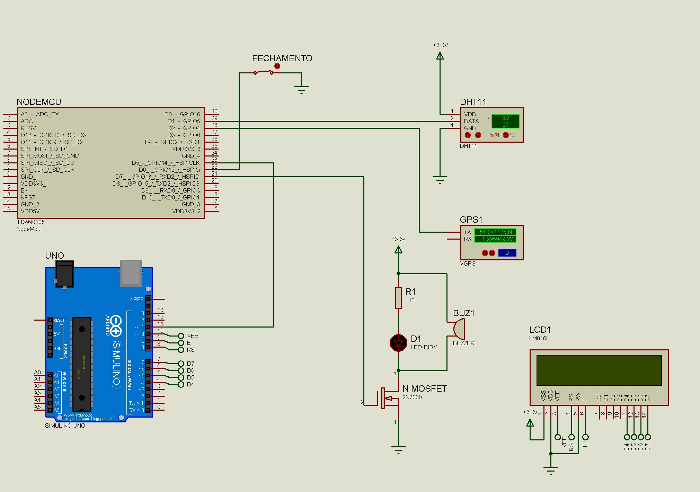
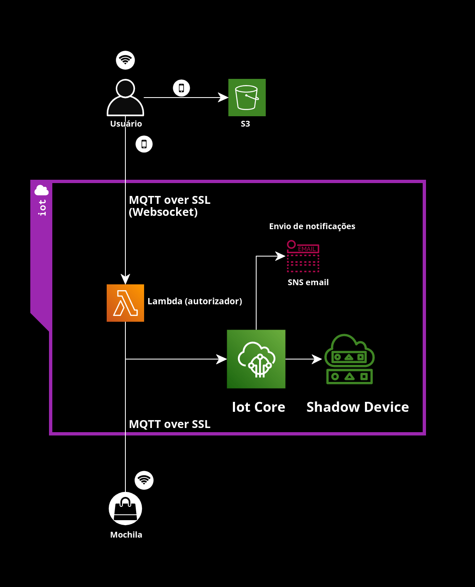

# Módulo de segurança para malas e mochilas

## Descrição
O módulo de segurança é um dispositível que pode ser instalado em mochilas para garantir uma melhor segurança contra aberturas indesejadas, além de possibilitar o rastreio da mochila.

O módulo conta também com um painel lcd que exibe informações como temperatura e umidade do local em tempo real.

As informações de temperatura, umidade e geolocalização também estão disponíveis nesse [site](http://mochila.igoraugst.dev), com informações atualizadas constantemente.

## Lista de materiais

| Quantidade | Item              | Obs                 |
|------------|-------------------|---------------------|
| 1          | NodeMcu           | Utilizado o ESP8266 |
| 1          | DHT11             |                     |
| 1          | Módulo GPS Neo 6m |                     |
| 1          | Arduino UNO       |                     |
| 1          | LCD shield keypad |                     |
| 1          | Buzzer            |                     |
| 1          | Led               |                     |
| 1          | push-button       |                     |
| 1          | N-mosfet          | Utilizado o 2N7000  |
| 1          | Resistor 10kΩ     |                     |
| 1          | Protoboard        | Opcional            |
| 1          | Fonte protoboard  | Opcional            |

## Circuito

1. O circuito deve ser montado como o esquemático abaixo:




## Instalação

Para o desenvolvimento do algoritmo, foi utilizada a plataforma de desenvolvimento embarcado [Platformio](https://platformio.org/)

### NodeMcu

1. Primeiramente é necessário criar o arquivo `Secrets.h` dentro da pasta include, seguindo o modelo do arquivo `Secrets.example.h`. Após criar o arquivo, deve-se preencher o campo com a url do endpoint, nome do dispositivo, chave raiz, chave privada e certificado do dispositivo.
> Na seção de infraestrutura será explicado como obter esses dados

2. Executar o comando dentro da pasta do projeto com o dispositivo conectado ao computador:
```bash
platformio run --target upload --environment nodemcuv2
```

### Arduino

1. Executar o comando dentro da pasta do projeto com o dispositivo conectado ao computador:
```bash
platformio run --target upload --environment arduino
```

### Website
1. Entrar na pasta

2. Abrir o arquivo index.js e editar os campos com o endpoint, nome do autorizador, chave do Google Maps e os tópicos conforme apropriado.

3. Instalar as dependências com o comando:
```
npm install
```

4. Rodar o seguinte comando para construir o projeto

```
npm run bundle
```

## Infraestrutura

Toda infraestrutura foi criada dentro da AWS, utilizando diversos serviços como pode ser visto no diagrama abaixo:



Os dois principais serviços utilizados são o IoT core e o Shadow Device (Pertence ao IoT core).

### MQTT
MQTT é um protocolo de comunicação do tipo publish/subscribe, com foco em leveza e velocidade, sendo amplamente utilizado em dispositivos embarcados e no ramo do IoT.

Nesse protocolo é possível que cada dispositivo se inscreva em tópicos MQTT desejados. Quando algum dispositivo enviar uma mensagem para o tópico inscrito, o dispositivo receberá a mensagem.

### IoT core
O IoT core é um serviço para internet das coisas que permite a conexão de dispositivos utilizando o protocolo MQTT ou Lorawan. Para este projeto foi utilizado o MQTT.

1. Dentro da página do IoT core , na aba "Todos os dispositivos", crie uma nova "coisa" seguindo as instruções dadas e baixe os arquivos de chave privada, chave raíz e certificado do dispositivo, são essas chaves que devem ser adicionadas no código do NodeMcu.

> Caso queira, também é possível utilizar uma autoridade certificadora em vez de baixar os arquivos.

2. Na aba de configurações é possível obter o endpoint para adicionar no código do NodeMcu e no website.

### Autorização Front-end
O IoT core para realizar a autenticação do usuário e garantir a segurança de acesso aos endpoints, utiliza o certificado de cliente X.509. Porém não é possível utilizar esses certificados no front-end, visto que eles devem ser mantidos privado. Para corrigir esse problema foi criado um autorizador customizado que é executado ao receber um pedido de conexão com um dos parâmetros sendo o nome do autorizador. Esse autorizador pode ser adicionado na página de segurança/autorizadores, na aba inicial do AWS IoT Core.

### Lambda
O autorizador mencionado anteriormente é uma função lambda, tendo o código localizado na pasta "lambda". Para fazer deploy:

1. Dentro da pasta lambda execute o seguinte comando:

```bash
zip function.zip authorizer.py
```

```
aws lambda create-function --function-name autorizador \
--zip-file fileb://function.zip --handler lambda_function.lambda_handler --runtime python3.8 \
--role {arn da role}
```

### Device Shadows
O Shadow Device é um serviço que permite armazenar o estado do dispositivo e disponibilizá-los para outros serviços, mesmo que o dispositivo físico esteja desconectado. Além disso, o serviço permite enviar o estado do dispositivo real e o estado desejado do dispositivo.

1. Para criar o Shadow Device, é necessário entrar na página do dispositivo anteriormente criado, ir na aba "Device Shadows" e criar dois dispositivos nomeados como "location" e "weather". Esses dispositivos possuem o seguinte esquema:

```json
{
    "state":{
        "reported":{
            "lat": 00.00,
            "lon": 00.00
        }
    }
}
```

```json
{
    "state":{
        "reported":{
            "temp": 00.00,
            "hum": 00.00
        }
    }
}
```

2. Com o dispositivo criado, na aba de Device Shadows é possível obter os tópicos para adicionar no código fonte.

### SNS
O SNS (Simple notification service) é um serviço de envio de notificações, que pode enviar mensagens de SMS e email. Esse serviço foi utilizado para enviar emails contendo a localização da mochila.

Para utilizar o serviço é necessário:

1. Criar um tópico SNS e cadastrar o email para ser enviado

2. Vincular o Iot Core com o tópico SNS por meio do Iot Core Rules e adicionar a consulta para obter os dados:

```SQL
SELECT state.reported.lat, state.reported.lon FROM '$aws/things/mochila/shadow/name/location/update'
```

### S3
O S3 (Simple Storage Service) é um serviço de armazenamento que pode ser configurado para hospedar um site estático.

## Funcionamento
O NodeMcu realiza a leitura dos sensores conforme o tempo pré estabelecido, a cada uma dessas leituras, os dados serão serializados em formato JSON e enviados para os tópicos MQTT correspondentes. No caso da Temperatura e Umidade, os dados serializados são enviados para o Arduino controlando o painél lcd por meio da comunicação serial UART. O site ao ser inicializado realiza a incrição nos tópicos necessário e fica aguardando as mensagens, ao receber uma mensagem, a interface é atualizada.

A detecção de violação da mala é feito por meio de um cabo aterrado conectado ao pino do NodeMcu, quando a conexão é rompida, o dispositivo detecta essa alteração e aciona o alarme.

## Utilização
1. Na primeira conexão do dispositivo, deve-se conectar na rede wifi `ESP-igor` com a senha `esp123456`

2. Ao conectar, digite na barrade busca do navegador: [192.168.4.1](http://192.168.4.1)

3. No site acessado, clique no botão "Configure Wifi"

4. No menu aberto, clique na sua rede wifi e digite sua senha


> As conexões seguintes na mesma rede são feitas automaticamente.

5. O painel LCD exibe informações da conexão, da temperatura e da umidade, constantemente atualizados

6. Os botões Up e Down do painel podem ser utilizados para controlar o brilho.

7. Os dados também ficam disponíveis no site [mochila.igoraugst.dev](http://mochila.igoraugst.dev)
